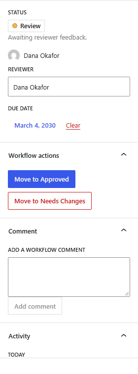
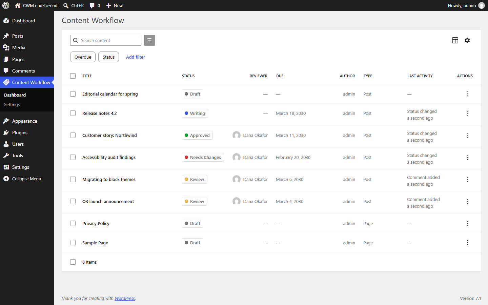
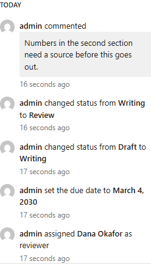
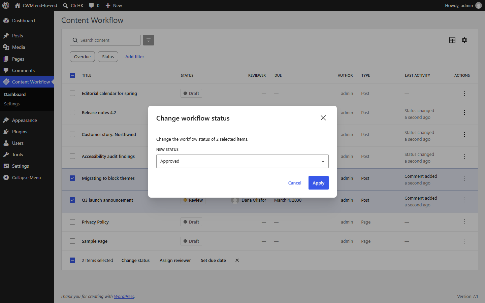
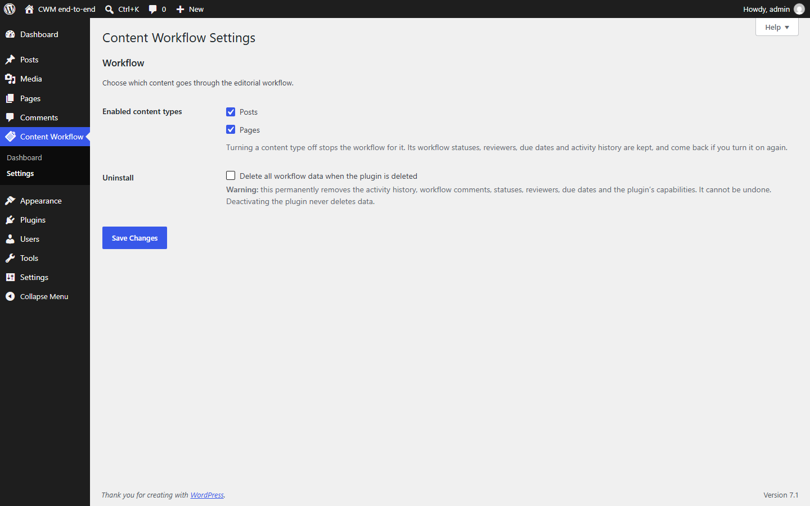

# Content Workflow Manager

An editorial approval workflow for WordPress. Posts, pages and custom post
types get a **workflow status**, an assigned **reviewer**, a **due date**,
threaded **workflow comments** and a complete **activity history** — managed
from a Gutenberg sidebar and an admin dashboard, and enforced entirely in PHP.



```
React Gutenberg UI  ──►  REST API  ──►  PHP Workflow Engine
                         sit-cwm/v1     │
                                        ├─► Permissions  (PermissionManager)
                                        ├─► Transition rules (TransitionManager)
                                        ├─► WordPress data (post meta)
                                        └─► Activity log  (wp_sit_cwm_activity)
```

The arrows only point one way. The React UI never decides whether a transition
is allowed; it renders what the server told it is possible and sends the move
back for the server to re-derive from scratch. See
[ARCHITECTURE.md](ARCHITECTURE.md).

---

## Features

- **Six-status editorial workflow** — Draft → Writing → Review → Needs Changes
  → Approved → Published, with a fixed transition graph and explicit rollback
  paths. See [WORKFLOW.md](WORKFLOW.md).
- **Server-side transition validation.** Every move is re-checked against the
  transition map, the capability map and the post's *current* stored status. A
  client that posts `{"status": "approved"}` gets the same answer as one that
  clicks the button.
- **Optimistic concurrency.** A status change must state the status the client
  believed was current; if someone else moved the post meanwhile the request
  fails with `409` instead of silently overwriting.
- **Six dedicated capabilities** (`sit_cwm_*`), granted to roles at activation.
  No role names are hard-coded anywhere else in the plugin.
- **Reviewer assignment and due dates**, with an *Overdue only* filter computed
  in the site timezone.
- **Workflow comments** stored alongside the audit trail, not in `wp_comments`.
- **Activity history** in a dedicated indexed table, never a growing serialized
  meta array.
- **Gutenberg editor sidebar** — status, reviewer, due date, transition buttons
  and the timeline, without leaving the editor.
- **Admin dashboard** built on `@wordpress/dataviews`: server-side search,
  filtering, sorting and pagination, row actions and bulk actions over up to
  100 posts per request.
- **A real REST API.** Everything the UI does is a documented, authenticated
  endpoint — see [REST-API.md](REST-API.md) for `curl` examples.

### What v1.0 deliberately does *not* do

Being honest about this is part of the design:

- **No email.** Assigning a reviewer does not notify anyone.
- **No automatic publishing.** Reaching the `published` workflow status does
  **not** publish the post — that stays a deliberate editor action. Workflow
  status and WordPress post status are separate fields on purpose
  ([why](ARCHITECTURE.md#why-workflow-status-is-not-wordpress-post-status)).
- **No Slack, no calendar, no rules engine, no multiple workflows.** Those are
  named in the [roadmap](#roadmap), not shipped.

---

## Screenshots

| | |
|---|---|
|  |  |
| **Editor sidebar** — status, reviewer, due date and the transitions this user may actually perform. | **Dashboard** — every managed post, filtered and sorted server-side. |
|  |  |
| **Activity timeline** — who changed what, when, grouped by day. | **Bulk actions** — change status, assign a reviewer or set a due date across a selection. |
|  | |
| **Settings** — which post types get a workflow, and what happens on uninstall. | |

See [docs/screenshots/README.md](docs/screenshots/README.md) for how these are
captured.

---

## Requirements

| | |
|---|---|
| WordPress | 6.5 or newer |
| PHP | 7.4 or newer |
| Tested up to | WordPress 6.7 |

The plugin loads no PHP 7.4+ syntax before checking `PHP_VERSION`, so on an
older PHP it shows an admin notice instead of fataling.

---

## Installation

### From a release zip

1. Download `content-workflow-manager.zip` from the
   [releases page](https://github.com/shappire-it/content-workflow-manager/releases).
2. **Plugins → Add New → Upload Plugin**, choose the zip, install, activate.

Activation creates the `wp_sit_cwm_activity` table and grants the six
capabilities to the administrator, editor, author and contributor roles.

### From a clone

`assets/build/` is committed, so a clone runs as-is — no build step needed:

```sh
git clone https://github.com/shappire-it/content-workflow-manager.git
# into wp-content/plugins/, then activate in wp-admin
```

Composer is only needed for development; the plugin ships a fallback autoloader
for when `vendor/` is absent.

---

## Quick start

1. Activate the plugin.
2. **Content Workflow → Settings** — choose which post types the workflow
   applies to (default: posts and pages).
3. Open a post in the block editor and click the **Content Workflow** icon in
   the top-right toolbar. Every managed post starts at **Draft**.
4. Move it along: **Draft → Writing** when you start, **Writing → Review** when
   it is ready, and assign a reviewer plus a due date.
5. The reviewer either **Approves** it or sends it back with **Needs Changes**,
   leaving a workflow comment explaining why.
6. **Content Workflow → Dashboard** shows everything in flight.

### The six statuses, and who can reach each one

| Status | Meaning | Required capability |
|---|---|---|
| **Draft** | Not yet started in the workflow. The default. | `sit_cwm_change_workflow` |
| **Writing** | The author is working on it. | `sit_cwm_change_workflow` |
| **Review** | Awaiting reviewer feedback. | `sit_cwm_change_workflow` |
| **Needs Changes** | Sent back to the author. | `sit_cwm_review_content` |
| **Approved** | Cleared for publication. | `sit_cwm_approve_content` |
| **Published** | The cycle is complete. | `sit_cwm_approve_content` **+** WordPress `publish_post` |

On top of the capability, every move also requires WordPress' own `edit_post`
on that specific post, and a post type the workflow is enabled for.

### Default role grants

| Role | Capabilities granted at activation |
|---|---|
| Administrator | all six |
| Editor | `change_workflow`, `assign_reviewer`, `review_content`, `approve_content`, `view_activity` |
| Author | `change_workflow`, `view_activity` |
| Contributor | `change_workflow`, `view_activity` |
| Subscriber | none |

The other two capabilities are `sit_cwm_assign_reviewer` (set or clear the
reviewer and due date) and `sit_cwm_manage_workflows` (settings page, bulk
actions). Grants are ordinary role capabilities — any capability-management
plugin can change them.

---

## Architecture summary

```
includes/
  Core/       Plugin, Container, Activator/Deactivator, Database, Settings, Assets
  Workflow/   WorkflowManager, StatusManager, TransitionManager,
              PermissionManager, Capabilities, BulkProcessor
  Content/    PostMeta, PostRepository
  Activity/   ActivityLogger, ActivityEntry
  REST/       Workflow / Activity / Posts / Batch / User controllers
admin/        Dashboard, Settings
src/          React source (sidebar + dashboard)
assets/build/ compiled output (committed)
```

Three rules hold the design together:

1. **`WorkflowManager` is the only way to change workflow state.** REST
   controllers, bulk actions and the React app are thin clients over it.
2. **`TransitionManager` answers "is this edge in the graph?"; `PermissionManager`
   answers "may this user do it?".** Neither knows about the other.
   `WorkflowManager` is the only place they meet, so neither can be bypassed
   through the other.
3. **Workflow status is not WordPress post status.** They are separate fields
   that never write to each other.

Full detail — the `transition()` pipeline, the data model, the concurrency
guard and the known trade-offs — is in [ARCHITECTURE.md](ARCHITECTURE.md).

---

## Extensibility

Free core fires these so Pro add-ons (and your own code) can extend it without
touching a core file. Every one is prefixed `sit_cwm_`.

### Actions

| Hook | Signature | Fires |
|---|---|---|
| `sit_cwm_status_changed` | `( int $post_id, string $from, string $to, int $user_id )` | After a status change is persisted and logged. |
| `sit_cwm_reviewer_assigned` | `( int $post_id, int $reviewer_id, int $previous_id, int $user_id )` | After the reviewer changes. `$reviewer_id === 0` means cleared; `$user_id === 0` means the system did it, which is how a deleted user's assignments are cleaned up. |
| `sit_cwm_due_date_changed` | `( int $post_id, string $date, string $previous, int $user_id )` | After the due date changes. `''` means cleared. |
| `sit_cwm_comment_added` | `( int $post_id, int $activity_id, string $message, int $user_id )` | After a workflow comment is stored. |
| `sit_cwm_activity_logged` | `( int $activity_id, ActivityEntry $entry )` | After any activity row is written. |
| `sit_cwm_db_upgraded` | `( string $from_version, string $to_version )` | After the schema is migrated. |

### Filters

| Hook | Signature | Controls |
|---|---|---|
| `sit_cwm_statuses` | `( array $statuses )` | The status registry. Entries need `slug` + `label`; invalid ones are dropped and the `draft` default must survive. |
| `sit_cwm_transition_map` | `( array $map )` | The transition graph, as `from => [ to, … ]`. Unknown statuses and self-transitions are stripped. |
| `sit_cwm_rollback_transitions` | `( array $rollbacks )` | Which of those edges count as "sending content back", for UI styling. |
| `sit_cwm_status_capability_map` | `( array $map )` | Target status → required capability. |
| `sit_cwm_can_transition` | `( bool $allowed, int $post_id, string $from, string $to, int $user_id )` | **The last word on a permission decision.** Runs after the capability checks; only boolean `true` allows. |
| `sit_cwm_available_transitions` | `( array $transitions, int $post_id, string $from, int $user_id )` | The UI's button list. May remove, reorder or relabel — never add a move the user was not already allowed. |
| `sit_cwm_enabled_post_types` | `( string[] $post_types )` | Which post types have a workflow. |
| `sit_cwm_activity_actions` | `( string[] $actions )` | Loggable action slugs. |
| `sit_cwm_activity_action_labels` | `( array $labels )` | Human-readable labels for those slugs. |
| `sit_cwm_assignable_reviewers` | `( array $query, int $post_id, int $user_id )` | `get_users()` arguments behind `GET /users`. `fields` and `count_total` are re-forced afterwards. |

`sit_cwm_can_transition` cannot grant a logged-out user, a missing post or a
post whose type has no workflow — those are hard gates checked before it runs.
It also cannot widen the transition *graph*; that is `sit_cwm_transition_map`.

```php
// Only let the assigned reviewer approve.
add_filter(
	'sit_cwm_can_transition',
	function ( $allowed, $post_id, $from, $to, $user_id ) {
		if ( 'approved' !== $to ) {
			return $allowed;
		}

		return $allowed && (int) get_post_meta( $post_id, '_sit_cwm_reviewer_id', true ) === $user_id;
	},
	10,
	5
);
```

```php
// Notify Slack when something is approved (this is what Pro does).
add_action(
	'sit_cwm_status_changed',
	function ( $post_id, $from, $to, $user_id ) {
		if ( 'approved' === $to ) {
			my_slack_notify( $post_id, $user_id );
		}
	},
	10,
	4
);
```

---

## Development

```sh
composer install
npm ci
npm run build
npm run env:start        # wp-env (Docker)
```

Then run the suites:

```sh
composer lint            # phpcs, WordPress-Extra, zero errors required
composer test            # PHP unit (no WordPress)
composer test:setup && composer test:integration
npm run test:unit        # Jest
npm run test:e2e         # Playwright
```

[DEVELOPMENT.md](DEVELOPMENT.md) covers the Docker-free setup, the build
pipeline, the performance budgets and the release process.
[CONTRIBUTING.md](CONTRIBUTING.md) covers the coding standards and what a PR
needs to be mergeable.

---

## Roadmap

Named because they are planned, not because they exist. These are Pro scope and
are deliberately **not** in Free core — but the hooks above are the surface they
attach to.

- Multiple workflows, and per-role workflow configuration
- Email notifications and Slack integration
- Editorial calendar
- Checklist gating before approval
- A workflow rules engine (if/then automation)
- Scheduled publishing driven by the `approved` status
- Advanced audit logs and exports

---

## License

GPL-2.0-or-later. See [LICENSE](LICENSE).

Copyright © 2026 Shappire IT.
